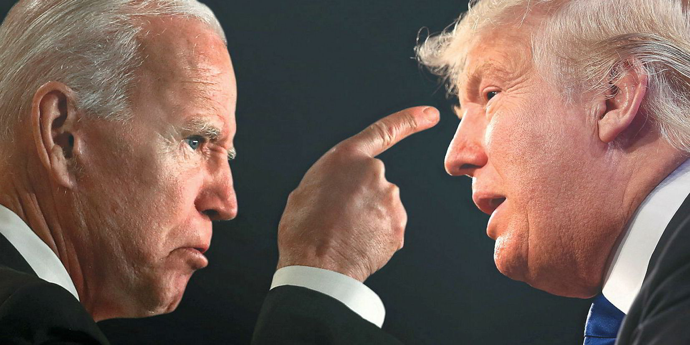

# AI Hate Speech Detection for 2020 Presidential Election

For this project I engineered an prompt to detect hate speech from a study of tweets during the 2020 presidential election using OpenAI's GPT-4 in a python notebook. I created a prompt to classify the tweets along five dimensions: Stance Detection (Favor, Against, Neither, Mixed, Neutral), Hateful (Hateful, Not Hateful), Discrimination Type (General, Sexist, Sexual Harassment, Homophobic, Racist, Transphobic, Ableist, Intellectual, Ageism), Severity (Mild, Moderate, Severe), and Directedness (Implicit, Explicit). After developing a structured prompt for GPT-4, I tested it on random tweet samples, refining the prompt to improve accuracy. The model's responses were then compared to the original labels, revealing an 80.71% overall similarity. However, challenges arose, such as the complexity of asking the model to handle multiple tasks simultaneously and the difficulty of evaluating its performance. Despite these obstacles, the project highlighted both the potential and limitations of using AI for moderating political discourse.

### Contents: 

- The analysis folder contains the code used to iterate the prompt through the set of tweets. The raw results from running the program are stored in final_output.csv and the cleaned up and analyzed results are in output.xlsx.
- The data_source folder contains information about the data and study the data was pulled from. The raw input data is in convabuse.csv.
- The write-up folder contains a pdf with a two and a half page write up going more into depth about the results of the experiment and challenges that arose. The prompt used for the project is also in that file.

### Data: 

The data from this project was collected from a study in the Association for Computational Linguistics Journal by Laura Grimminger and Roman Kingler titled “Hate Towards the Political Opponent: A Twitter Corpus Study of the 2020 US Elections on the Basis of Offensive Speech and Stance Detection". The data included tweets from the 2020 Election cycle regarding Donald Trump, Joe Biden, and Kanye West. The tweets were pre-labeled across two dimensions: Stance Detection (Favor, Against, Neither, Mixed, Neutral) and Hateful (Hateful, Not Hateful). More information on this data and the study can be found at: https://aclanthology.org/2021.wassa-1.18/

### Tools + Skills

- Python
- OpenAI API
- Prompt Engineering
- Content Moderation
